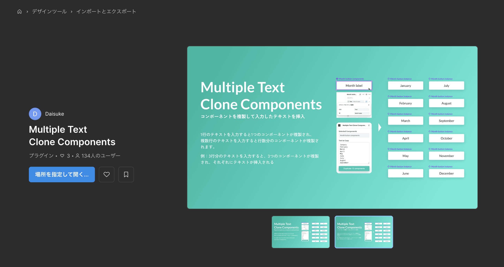

公開中のプラグイン： https://www.figma.com/community/plugin/1442375620443099072/multiple-text-clone-components

実行イメージ：

1. プラグインの入力欄に47都道府県のテキストを入力（1行＝1都道府県）
2. 流し込みたいコンポーネントを選択
3. プラグインを実行
4. 47個のコンポーネントが複製され、それぞれに都道府県のテキストが挿入される

