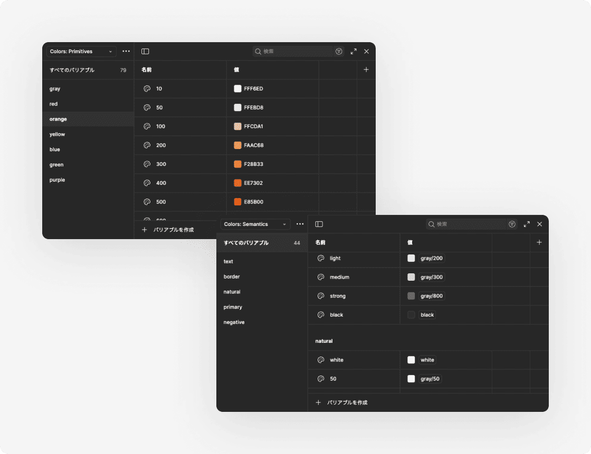
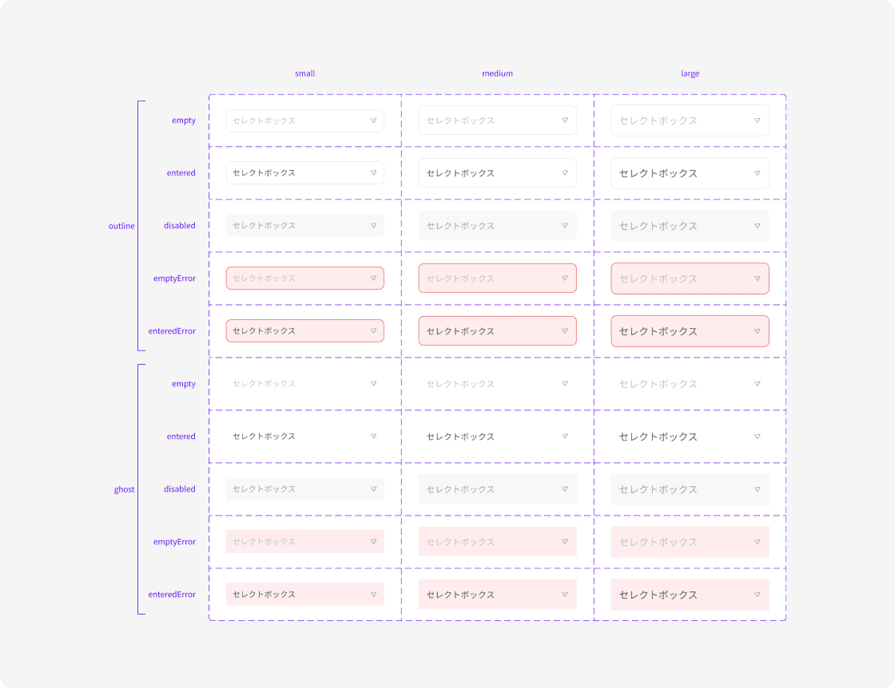
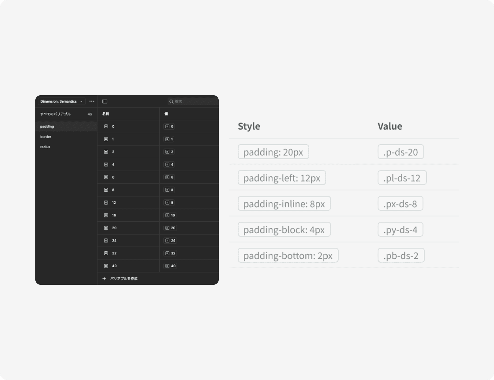

本プロダクトの品質担保の責任者として、初期開発から保守運用まで様々な工程を担当しました。

- Figmaを用いたUIデザインとデザインシステムの構築、コンポーネントやバリアブルの設計
- Next.jsとLaravelを用いた実装、データベースやAPIの設計及びレビュー
- Claude Codeを用いた運用の効率化、AIアーキテクチャの設計
- 課題抽出と施策立案、Notionを用いた施策の管理（優先度の判断やアサイン割り振り）

業務管理システム（フロントエンド／バックエンドの2リポジトリ、Next.js + Laravel）の開発を、Claude Code を主戦力として進めている。

重視しているのは「うまいプロンプトを書くこと」ではなく、**同じ失敗を二度させない仕組みをリポジトリに残すこと**。作業のたびに手順書（スキル）と注意書き（ルール）を更新し、プロジェクト自体を育てていく運用にしている。

| 運用期間 | 自作スキル | ルール | 振り返りPR | セッションログ |
|---|---|---|---|---|
| 3.5ヶ月 | 13種 | 14件 | 8本 | 26日分 |

## Figmaで組んだデザインシステム

実装の前に、色・寸法・コンポーネントの3つをFigmaのバリアブルとして定義した。デザインと実装で同じ名前を使えるようにしておくと、レビューの指摘が「この余白を詰めて」ではなく「ここは `py-ds-4`」で済む。

::::columns{cols=3}

:::col

### デザイントークン設計
カラーやフォント、スペーシングなどはプリミティブトークンとセマンティックトークンで定義して、使用時にはバリアブルやスタイルから参照する運用を構築しました。
:::

:::col

### コンポーネント設計
モジュール系やそれらを組み合わせたオブジェクトは全てコンポーネント化して、バリアントやプロパティでUIの変化を一元管理しています。また、コンポーネントやプロパティの命名規則、実装側との連携ルールなども策定しました。
:::

:::col

### 実装側との連携
エンジニア向けにTailwind ClassやReactとの連携ルールを定めたり、デザインシステムを実装側に組み込む作業を行いました。
:::

::::

## リポジトリに置いている6つの層

### リポジトリに置いている6つの層

AIに渡す情報を、更新頻度と寿命で分けて置いている。毎回読ませるものは短く、詳細は必要なときだけ開かせる。

| 層 | 役割 | 中身 |
|---|---|---|
| プロジェクト規約 | 常時読み込まれる憲法。短く保つ | 言語・出力スタイル・禁止操作・スコープの守り方 |
| スキル | 繰り返す作業の手順書。作業種別ごとに発火 | 立案／要件定義／情報設計／実装／レビュー／同期／振り返り |
| ルール | 一度踏んだ失敗と、その再発防止の定型動作 | 「一見おかしいが理由がある実装」の記録もここ |
| ドキュメント | ドメイン知識とデザイン規約 | 用語集・情報設計・画面レシピ・コンポーネントカタログ |
| セッションログ | 会話が切れても作業を再開できるようにする | 日付単位で、プロンプト原文・方針・結果を追記 |
| 施策ディレクトリ | 課題ID単位で成果物をまとめる | 立案メモ・要件定義書・プロトタイプ・テスト仕様 |

## ワークフロー

課題から実装までを一本の流れとして定義し、各工程にスキルを対応させている。最後の「振り返り」が手順書そのものを書き換えるので、流れは閉じずに一周して戻る。

| 工程 | やること |
|---|---|
| 1 施策立案 | 課題の深掘り → 発散 → 効果・コスト・リスクで収束 |
| 2 要件定義 | AsIs／ToBe・機能要件・実装順序・未解決事項 |
| 3 プロトタイプ（任意） | UI案の方向性だけを検証。本番コードには触れない |
| 4 本開発 | 着手前チェック → 実装 → 検証コマンド表を全消化 |
| 5 独立レビュー | 別エージェントが要件と成果物だけを見て突合 |
| 6 振り返り | つまずきをルール化してPRにする |

横断で走るスキル：情報設計（画面を作る前）／既存画面準拠のUI作成／APIテスト同期／コンポーネントカタログ同期／デザインドキュメント同期／セッションログ

## スキル設計で効いた4点

**1. 呼び出しを人間に覚えさせない**
スキルの説明文に「〜のとき必ず使用」と、実際に自分が言いがちな言い回し（「この機能を追加して」「気になる点はない？」）を並べておく。人間側がスキル名を思い出す必要がなくなる。

**2. 手順書ではなくチェックリスト**
着手前の確認項目、検証コマンドの表、完了条件を箇条書きで持たせる。判断が要る箇所には「止まって質問する」と明記し、勝手に進ませない。

**3. スキルからスキルを呼ぶ**
実装スキルの仕上げが、テスト同期・カタログ同期・デザインドキュメント同期を呼び出す。付随作業を「思い出せたらやる」から外す。

**4. 「同期」を独立スキルに切る**
コードとテスト／ドキュメントのズレは、別タスクにすると必ず溜まる。エンドポイントを触ったら同じタスクの中でテストを直す、と決めて手順化した。

## ルールは「失敗の記録」で書く

注意書きを標語で書いても守られない。実際に起きたことと、次に取るべき具体的な動作までを1ファイル1件で書く形式に統一している。

> **ルール**：フロント側の送信コードだけを見て「このデータは送られていない」と断定しない。
>
> **Why**：送信コードに無いことを根拠に「この機能は壊れている」と報告したが、実際は共通処理が値を補完していて正常に動いていた。誤った前提のまま修正を入れ、差し戻しになった。
>
> **How to apply**：断定する前に共通処理の設定を確認する。運用実績と食い違う結論が出たら、まず自分の分析を疑う。「壊れている」と報告する前に、実際にその操作が失敗するかを確認する。

他のルールの例：

- **検証は最新のコード経路で作ったデータで行う** — 過去データは古い実装の産物なので、現行コードでは起こり得ない差分に振り回される。実際、作り直して検証したら過去データでは出なかったバグが見つかった。
- **テストデータの固定値には理由をコメントで残す** — 理由が書かれていない固定値は「不要な指定」として消される。消した結果、実行するたびに成否が変わるテストになった。
- **使っていない機能は「対象外」と明文化する** — 未使用画面への追従指摘がレビューのたびに発生していたので、触らない・指摘は対象外として閉じる、とルール化した。
- **推論と実測を書き分けさせる** — 「コードを読んだだけの推論」と「実行して確かめた事実」を区別して報告させる。断定口調の誤報がここで大きく減った。

## 振り返りをPRとして回す

作業が一段落したら振り返りスキルを実行する。会話を遡ってつまずきの兆候（訂正された・同じ指示を二度させた・スコープ外を勝手に触った・手戻りが出た）を拾い、スキルとルールへの差分をPRにする。

重要なのは**採否の基準**で、「このルールが無かったら、次回も同じ間違いをするか？」にYesのものだけを採用する。一般常識で判断できることや、その場限りの事情は入れない。既に書いてあるのに守られなかったものは、新しいルールを足すのではなく既存の記述を具体化する。こうしないとルールが増え続け、結局どれも読まれなくなる。

差分は必ず作業ブランチ経由。運用開始から、振り返り由来のPRを8本マージしている。

## レビューは文脈を持たない別エージェントに渡す

実装したのと同じ文脈でレビューさせると、実装時の思い込みがそのまま持ち込まれて素通りする。そこでレビューはサブエージェントに任せ、渡すのは**要件定義書・変更ファイル一覧・セッションログだけ**にして、実装の経緯は渡さない。

報告形式も固定した。「重大な問題（発見・修正したもの）」「軽微・スコープ外と判断したもの（その理由）」「問題なしと確認した観点」の3分類。何を見ていないかが分かるようにするのが狙い。

## ガードレール

本番コードを触らせる以上、事故の形をあらかじめ潰しておく。「読み取りと検証は素通し、書き込みと破壊は止める」を基本方針に、権限設定と規約の両方で二重に縛っている。

| 扱い | 対象 |
|---|---|
| 素通し | 差分・ログの確認、型チェック、Lint、ビルド、フォーマッタの検査、マイグレーションのドライラン |
| 人間の手で | コミット・push・PR作成などの書き込み系の操作。AIは提案までで止める |
| 中断 | 保護ブランチ上にいたら作業せず報告する。作業ブランチが古い場合もリスクを申告してから進める |
| 禁止 | 作業ディレクトリの外に出る操作。ディレクトリ移動そのものを権限設定で拒否している |
| 確認 | 再帰削除など、取り返しのつかないコマンドは毎回確認を挟む |

## わかったこと

**1. 指示の質より、仕組みの質**
プロンプトを磨くより、同じ失敗を二度させない仕掛けをリポジトリに置くほうが効果が大きい。プロンプトはセッションで消えるが、ルールは残って次の人（次の自分）にも効く。

**2. ルールは「書いた」だけでは守られない**
効くのは、作業手順のチェックリストに埋め込まれたときだけ。ルールを増やすときは、必ずどのスキルのどの段階で読ませるかまで決める。

**3. スコープの線引きを先に明文化する**
依頼と無関係な問題を見つけても、深掘りせず1行添えるだけ。事実を聞かれている場面で修正案を出さない。この2つを規約にしてから、やり取りの空転がはっきり減った。

**4. 「わからないまま進めない」を鉄則にする**
止まって質問させるほうが、それらしい成果物を出させて後から直すより速い。手戻りのコストは、確認1往復よりずっと高い。

※ プロジェクト固有の名称・仕様は伏せ、運用の設計部分のみを抜き出して構成しています。
